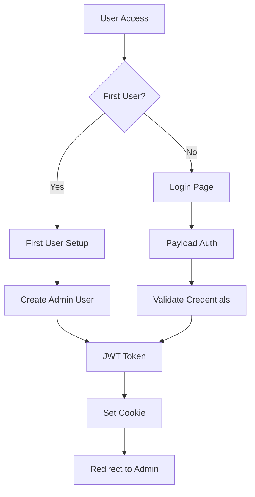
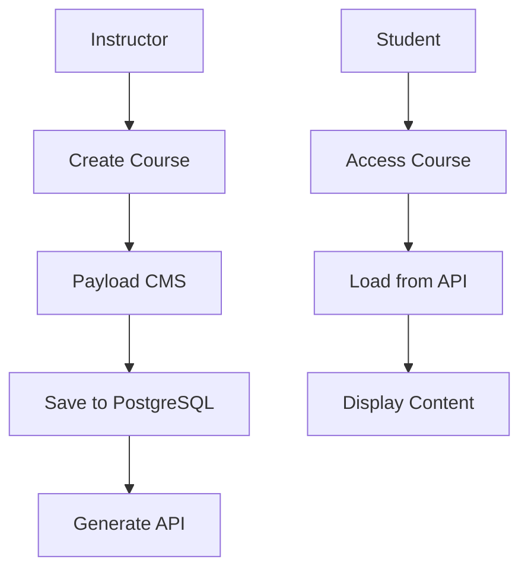
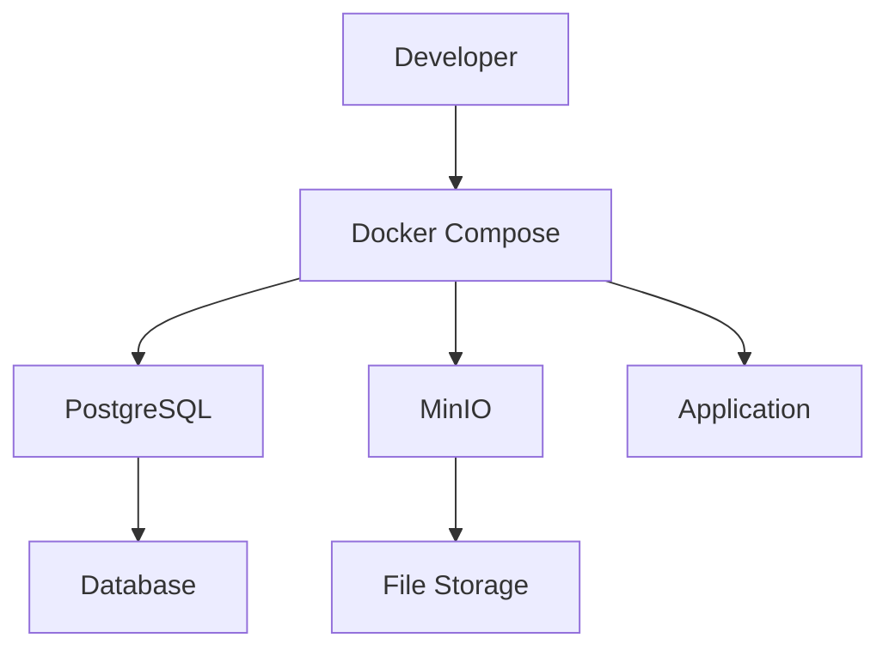
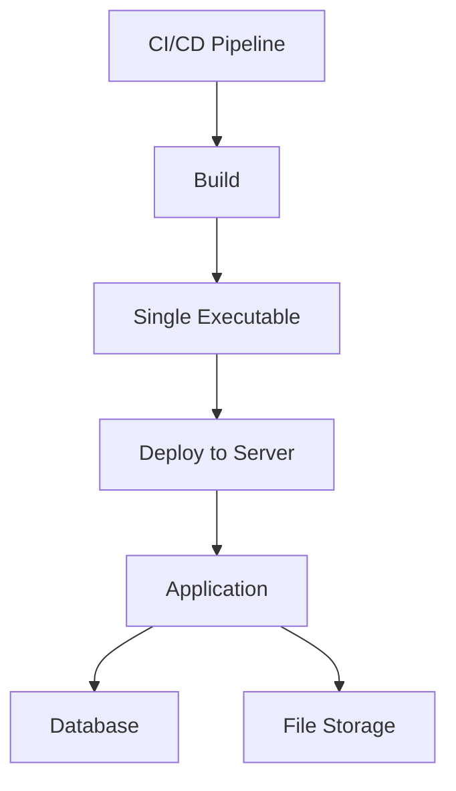

# Architecture Overview

This document provides a comprehensive overview of the Paideia LMS architecture, explaining the design decisions, technology stack, and system components.

## 🏗️ System Architecture

Paideia LMS follows a modern, modular architecture designed for scalability, maintainability, and developer experience.

```
┌─────────────────┐    ┌─────────────────┐    ┌─────────────────┐
│   Frontend      │    │    Backend      │    │    External     │
│   (React Router)│◄──►│   (Elysia.js)   │◄──►│   Services      │
└─────────────────┘    └─────────────────┘    └─────────────────┘
         │                       │                       │
         │                       │                       │
    ┌────▼────┐             ┌────▼────┐             ┌────▼────┐
    │ Mantine │             │ Payload │             │PostgreSQL│
    │   UI    │             │   CMS   │             │Database  │
    └────┬────┘             └────┬────┘             └────┬────┘
         │                       │                       │
         │                       │                       │
    ┌────▼────┐             ┌────▼────┐             ┌────▼────┐
    │ React   │             │ TypeScript│           │  MinIO   │
    │ Router  │             │          │            │  S3 API  │
    │   v7    │             │          │            │          │
    └─────────┘             └─────────┘             └─────────┘
```

## 🏢 Core Components

### Frontend Layer

#### React Router v7 (Framework Mode)
- **Purpose**: Modern React framework with file-based routing
- **Features**:
  - Server-side rendering (SSR)
  - Nested routing with layouts
  - Form handling with actions
  - Built-in data loading with loaders
  - TypeScript-first approach

#### Mantine UI Components
- **Purpose**: Modern React component library
- **Features**:
  - Consistent design system
  - Dark/light theme support
  - Accessible components
  - Form handling utilities
  - Notification system

### Backend Layer

#### Elysia.js Web Framework
- **Purpose**: High-performance TypeScript web framework
- **Features**:
  - Type-safe routing
  - Built-in validation with Zod
  - OpenAPI/Swagger integration
  - Plugin ecosystem
  - Excellent TypeScript support

#### Payload CMS
- **Purpose**: Headless CMS and application framework
- **Features**:
  - Authentication and authorization
  - Content management
  - Database ORM with migrations
  - Admin panel generation
  - API generation

### Data Layer

#### PostgreSQL Database
- **Purpose**: Robust relational database
- **Features**:
  - ACID compliance
  - Advanced querying capabilities
  - JSON/JSONB support
  - Full-text search
  - Excellent performance

#### MinIO Object Storage
- **Purpose**: S3-compatible object storage
- **Features**:
  - S3 API compatibility
  - Scalable storage solution
  - File versioning
  - Access control
  - Web-based management console

## 📁 Project Structure

```
paideia/
├── app/                          # Frontend Application
│   ├── routes/                   # React Router Routes
│   │   ├── admin.tsx            # Admin panel
│   │   ├── first-user.tsx       # First user setup
│   │   ├── login.tsx            # Authentication
│   │   └── ...                  # Other routes
│   ├── utils/                   # Frontend utilities
│   └── assets/                  # Static assets
├── server/                      # Backend Server
│   ├── payload.config.ts        # CMS configuration
│   ├── internal/                # Internal utilities
│   │   ├── check-first-user.ts  # First user detection
│   │   └── register-first-user.ts # User registration
│   └── static/                  # Static file serving
├── src/migrations/              # Database migrations
└── scripts/                     # Build and utility scripts
```

## 🔄 Data Flow

### Authentication Flow


### Course Management Flow


## 🔧 Key Design Decisions

### Single Executable Architecture
- **Decision**: Package entire application as a single binary
- **Benefits**:
  - Easy deployment
  - Consistent environments
  - Reduced dependency issues
  - Simplified DevOps

### TypeScript-First Approach
- **Decision**: Use TypeScript throughout the entire stack
- **Benefits**:
  - Type safety
  - Better IDE support
  - Reduced runtime errors
  - Self-documenting code

### Framework Mode vs Library Mode
- **Decision**: React Router v7 in Framework Mode
- **Benefits**:
  - File-based routing
  - Automatic code splitting
  - Built-in SSR support
  - Convention over configuration

### No Dynamic Plugin System
- **Decision**: Built-in functionality only, no plugin architecture
- **Benefits**:
  - Simplified architecture
  - Better security
  - Easier maintenance
  - Predictable behavior

## 🔒 Security Architecture

### Authentication
- JWT-based authentication with secure cookies
- Password hashing with industry standards
- Session management with Payload CMS
- CSRF protection

### Authorization
- Role-based access control (Student/Instructor/Admin)
- Field-level permissions
- Route-level protection
- API access control

### Data Protection
- SQL injection prevention through ORM
- XSS protection with React
- File upload validation
- Environment variable encryption

## 🚀 Performance Optimizations

### Frontend Performance
- Code splitting with React Router
- Tree shaking with Bun
- CSS optimization
- Image optimization
- Caching strategies

### Backend Performance
- Connection pooling for PostgreSQL
- Query optimization with indexes
- Response caching
- Efficient serialization
- Background job processing

### Database Performance
- Proper indexing strategy
- Query optimization
- Connection pooling
- Migration management
- Backup strategies

## 🔌 External Integrations

### Supported Services
- **PostgreSQL**: Primary database
- **MinIO**: File storage
- **Redis**: Caching (planned)
- **Email Services**: Notifications (planned)
- **Analytics**: Usage tracking (planned)

### API Integration Points
- RESTful API endpoints
- Webhook support
- OAuth integration
- External tool integration
- LMS import/export

## 📊 Scalability Considerations

### Horizontal Scaling
- Stateless application design
- Database connection pooling
- File storage distribution
- Load balancing support

### Vertical Scaling
- Single-threaded architecture benefits
- Memory optimization
- Database query optimization
- Caching strategies

### Microservices Evolution
- Modular architecture design
- Service separation potential
- API-first approach
- Independent deployment capability

## 🔍 Monitoring & Observability

### Logging
- Structured logging with context
- Error tracking and reporting
- Performance monitoring
- User activity tracking

### Metrics
- Application performance metrics
- Database query metrics
- API usage statistics
- User engagement metrics

### Health Checks
- Application health endpoints
- Database connectivity checks
- External service monitoring
- Alert system integration

## 🛠️ Development Tooling

### Build Tools
- **Bun**: Fast build tool and runtime
- **Vite**: Frontend build tool
- **TypeScript**: Type checking and compilation
- **PostCSS**: CSS processing

### Development Tools
- **Docker Compose**: Local development environment
- **Hot Module Replacement**: Fast development
- **Type Safety**: Full TypeScript coverage
- **Linting**: Code quality enforcement

### Testing Strategy
- Unit tests for utilities
- Integration tests for components
- End-to-end testing (planned)
- Performance testing (planned)

## 🔄 Deployment Architecture

### Development Deployment


### Production Deployment


## 📈 Future Architecture Evolution

### Planned Enhancements
- **Microservices**: Break down into smaller services
- **Edge Computing**: CDN and edge function deployment
- **Advanced Caching**: Redis and application-level caching
- **Event-Driven Architecture**: Message queues and event processing
- **Multi-tenancy**: Support for multiple organizations

### Technology Upgrades
- Database sharding for large-scale deployments
- Advanced search capabilities
- Real-time features with WebSockets
- Mobile application development
- Advanced analytics and reporting

---

This architecture provides a solid foundation for a modern LMS while remaining flexible enough to accommodate future growth and feature additions.
