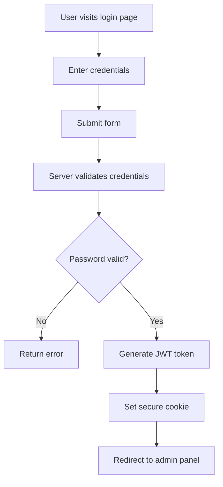
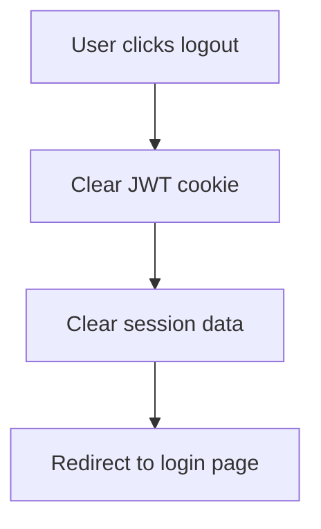

# Authentication System

This guide explains the authentication and authorization system in Paideia LMS, including user management, roles, permissions, and security features.

## 🔐 Overview

Paideia LMS uses **Payload CMS** as its authentication backbone, providing a robust and secure user management system with built-in features like password hashing, JWT tokens, and role-based access control.

## 👥 User Management

### User Roles

Paideia LMS supports three main user roles:

#### 1. **Administrator**
- Full system access
- User management capabilities
- Course creation and management
- System configuration access
- Analytics and reporting

#### 2. **Instructor**
- Course creation and management
- Student enrollment management
- Content upload and organization
- Assignment and grading capabilities
- Limited administrative access

#### 3. **Student**
- Course enrollment
- Content access
- Assignment submission
- Progress tracking
- Profile management

### User Model

Each user in the system has the following properties:

```typescript
interface User {
  id: string;
  email: string;           // Unique email address
  password: string;       // Hashed password
  firstName: string;      // User's first name
  lastName: string;       // User's last name
  role: 'admin' | 'instructor' | 'student'; // User role
  bio?: string;           // Optional biography
  avatar?: string;        // Optional avatar URL
  createdAt: Date;        // Account creation date
  updatedAt: Date;        // Last modification date
}
```

## 🔑 Authentication Flow

### First User Setup

When Paideia LMS is first installed, it automatically detects that no users exist and enforces the creation of the first administrator user.

#### Process:
1. **Detection**: System checks if any users exist in the database
2. **Redirection**: All routes redirect to `/first-user` if no users exist
3. **User Creation**: First user form collects admin information
4. **Automatic Login**: User is automatically logged in after creation
5. **Admin Panel**: User is redirected to the admin dashboard

### Login Process

#### Standard Login


#### Authentication Components:

**Frontend (React Router)**:
- Login form with validation
- Error handling and display
- Loading states

**Backend (Payload CMS)**:
- Credential verification
- Password hashing comparison
- JWT token generation
- Session management

### Logout Process



## 🔒 Security Features

### Password Security

#### Password Requirements
- Minimum 8 characters
- No specific complexity requirements (usability focus)
- Server-side validation with Zod schemas

#### Password Hashing
- Uses industry-standard bcrypt hashing
- Automatic salt generation
- Configurable hash rounds for security/performance balance

### JWT Tokens

#### Token Structure
```json
{
  "id": "user_id",
  "email": "user@example.com",
  "role": "admin",
  "exp": 1234567890,
  "iat": 1234567890
}
```

#### Token Security
- HTTPOnly cookies (prevents XSS attacks)
- Secure flag in production (HTTPS only)
- SameSite=Lax protection
- Configurable expiration time

### Session Management

#### Session Storage
- JWT tokens stored in secure cookies
- No server-side session storage (stateless)
- Token-based authentication

#### Session Security
- Automatic token expiration
- Secure cookie settings
- CSRF protection through origin validation

## 🔐 Authorization System

### Role-Based Access Control (RBAC)

#### Admin Permissions
- Full system access
- User management
- Course administration
- System configuration
- Analytics access

#### Instructor Permissions
- Course creation and editing
- Student enrollment
- Content management
- Assignment creation
- Grade management

#### Student Permissions
- Course viewing
- Assignment submission
- Progress tracking
- Profile editing

### Permission Implementation

#### Route-Level Protection
```typescript
// Protected route with role checking
export async function loader({ context }: Route.LoaderArgs) {
  const payload = context.get(dbContextKey).payload;
  const { user } = await payload.auth({ headers: request.headers });

  if (!user) {
    throw redirect("/login");
  }

  if (user.role !== "admin") {
    throw new Error("Insufficient permissions");
  }

  return { user };
}
```

#### Field-Level Permissions
```typescript
// Payload CMS field permissions
{
  name: "adminNotes",
  type: "textarea",
  admin: {
    condition: (req) => req.user?.role === "admin"
  }
}
```

## 🔧 Implementation Details

### Frontend Authentication

#### Login Form
- Built with Mantine components
- Client-side validation with Zod
- Server-side form handling with React Router actions
- Error display and loading states

#### Protected Routes
- Route loaders check authentication status
- Automatic redirects for unauthorized access
- Role-based route protection

### Backend Authentication

#### Payload Auth Configuration
```typescript
// server/payload.config.ts
export default buildConfig({
  auth: {
    // Global auth settings
  },
  collections: [
    {
      slug: "users",
      auth: true, // Enable authentication
      fields: [
        // User fields
      ]
    }
  ]
});
```

#### JWT Configuration
```typescript
// Payload auth settings
{
  slug: "users",
  auth: {
    tokenExpiration: "24h",
    maxLoginAttempts: 5,
    lockTime: 600000, // 10 minutes
    useAPIKey: false,
    cookies: {
      secure: process.env.NODE_ENV === "production",
      sameSite: "lax",
      httpOnly: true,
      maxAge: 86400 // 24 hours
    }
  }
}
```

### First User Registration

#### Automatic Detection
```typescript
// server/internal/check-first-user.ts
export async function checkFirstUser(): Promise<boolean> {
  const payload = await getPayload({ config: sanitizedConfig });
  const users = await payload.find({
    collection: "users",
    limit: 1,
  });

  return users.docs.length === 0;
}
```

#### First User Creation
```typescript
// server/internal/register-first-user.ts
export async function registerFirstUser(payload: Payload, request: Request, args: {
  email: string;
  password: string;
  firstName: string;
  lastName: string;
}) {
  // Create user with admin role
  const newUser = await payload.create({
    collection: "users",
    data: {
      ...args,
      role: "admin"
    },
    overrideAccess: true, // Skip permission checks
  });

  // Auto-verify the user
  await payload.update({
    id: newUser.id,
    collection: "users",
    data: { _verified: true },
  });

  // Log in the user
  const { token } = await payload.login({
    collection: "users",
    data: { email: args.email, password: args.password },
  });

  return { ...newUser, token };
}
```

## 🔄 User Lifecycle

### User Registration

#### Standard Registration Flow
1. User fills out registration form
2. Server validates input data
3. Password is hashed and stored
4. User account is created
5. Email verification (if enabled)
6. User can log in

#### First User Special Case
- Automatically assigned admin role
- Bypasses normal permission checks
- Auto-verified (no email confirmation needed)
- Immediate login after creation

### Password Reset

#### Password Reset Flow
1. User requests password reset
2. System generates secure token
3. Token sent via email (implementation needed)
4. User clicks reset link with token
5. Password update form displayed
6. New password hashed and stored

#### Security Measures
- Time-limited reset tokens
- One-time use tokens
- Secure token generation
- Rate limiting on reset requests

### Account Management

#### Profile Updates
- Users can update their own profiles
- Role changes require admin privileges
- Email changes may require re-verification
- Avatar uploads with file validation

#### Account Deactivation
- Admin can deactivate user accounts
- Deactivated users cannot log in
- Data preservation for audit purposes
- Reactivation by administrators

## 🛡️ Security Best Practices

### Password Security
- Use strong password hashing (bcrypt)
- Implement rate limiting on login attempts
- Enforce secure password policies
- Regular security updates

### Session Security
- Use secure, HTTPOnly cookies
- Implement CSRF protection
- Set appropriate token expiration times
- Monitor for suspicious login patterns

### Access Control
- Principle of least privilege
- Regular permission audits
- Role-based access enforcement
- Field-level security controls

### Audit Logging
- Log authentication events
- Track user actions
- Monitor failed login attempts
- Maintain access logs

## 🔧 Configuration Options

### Authentication Settings
```typescript
// Payload configuration
{
  slug: "users",
  auth: {
    // Token configuration
    tokenExpiration: "24h",
    maxLoginAttempts: 5,
    lockTime: 600000,

    // Security settings
    useAPIKey: false,

    // Cookie settings
    cookies: {
      secure: process.env.NODE_ENV === "production",
      sameSite: "lax",
      httpOnly: true,
      maxAge: 86400
    },

    // Password settings
    forgotPassword: {
      generateEmailHTML: ({ req, token, user }) => {
        // Custom email template
      }
    }
  }
}
```

### Rate Limiting
- Login attempt limiting
- Password reset request limiting
- API request throttling
- Brute force protection

## 🚀 Advanced Features

### Multi-Factor Authentication (Future)
- SMS-based 2FA
- Authenticator app support
- Hardware key integration
- Backup codes

### Single Sign-On (Future)
- OAuth 2.0 integration
- SAML support
- LDAP integration
- Social login options

### Advanced Authorization
- Granular permissions
- Object-level permissions
- Time-based access
- Location-based restrictions

## 🐛 Troubleshooting

### Common Authentication Issues

#### Login Failures
- Check password complexity requirements
- Verify user account is active
- Check for account lockouts
- Review server logs

#### Token Issues
- Verify JWT token expiration
- Check cookie settings
- Ensure HTTPS in production
- Validate token format

#### First User Setup Problems
- Ensure database is properly initialized
- Check migration status
- Verify environment variables
- Review server error logs

### Debug Mode

Enable debug logging for authentication:

```env
# Enable detailed auth logging
PAYLOAD_LOG_LEVEL=debug
DEBUG=payload:auth
```

## 📊 Monitoring and Analytics

### Authentication Metrics
- Login success/failure rates
- User registration trends
- Password reset frequency
- Account lockout incidents

### Security Monitoring
- Failed login attempts
- Suspicious activity detection
- Geographic login patterns
- Unusual access patterns

---

The authentication system provides a solid foundation for secure user management while maintaining ease of use and extensibility for future enhancements.
